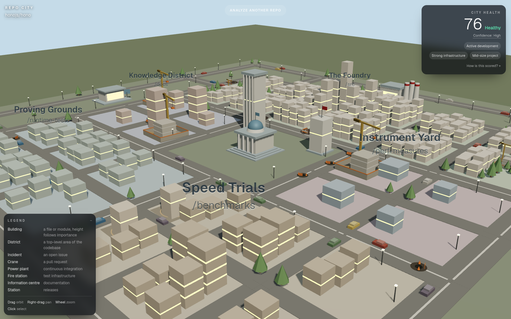

# Repo City

**Live demo: <https://repo-city-five.vercel.app>**



Paste any public GitHub repository and watch it become a living 3D city. Code becomes
architecture, pull requests become construction, CI becomes infrastructure, and unresolved
issues leave visible scars on the world. Fly through the entire project without ever leaving
one screen.

## One Screen

Repo City is one persistent 3D city viewport. There is exactly one route. Analysing a second
repository rebuilds the world in place; it does not navigate anywhere.

The internal rule the project was built against:

> The application consists of one persistent 3D city viewport. The user may move anywhere
> within that world, but the application never navigates to another application screen or
> replaces the city with another scene.

Orbiting, zooming, panning, focusing on an object, selecting, hovering, tooltips, the HUD and
the inspector are all allowed. Routes such as `/issues` or `/building/123`, full-screen
replacement views, wizards and separate scenes are not. You can go anywhere, but you never
leave the city.

## Visual mapping

| Repository signal | In the city |
| --- | --- |
| A file or module | A building. Height follows how central the file is; condition follows how recently it changed. |
| A top-level directory | A district, with its own plot, tint and sign. Names come from the architecture interpretation when there is one, otherwise from the directory itself. |
| An open issue | An incident: a scar in the street with barriers around it. Older and more-discussed bugs get larger, more disruptive scenes. |
| An open pull request | A construction site with a crane. Stalled PRs get an idle crane and a site that has clearly not moved. |
| Continuous integration | The power plant. Passing CI hums; recent failures and consistently red pipelines show it. No GitHub Actions means no power landmark, not a broken one. |
| Test infrastructure | The fire station. Bigger and busier as test directories, test files, test config and a test workflow appear. |
| Documentation | The information centre. Grows with a README, a docs directory, contributing guide, changelog, examples and API docs. |
| Releases | The station. Frequent releases make it busy; a repository that does not use GitHub Releases simply has a quiet one. |
| Recent commits and contributors | Traffic density, pedestrians and lit windows. |
| Archived status | Cold light, empty roads, idle cranes and an "Archived repository" label. Archived is reported as a fact, never as a failure. |
| Health score | A single 0-100 number in the corner with the weights behind it, plus a confidence level and the reasons for it. |

Everything on the map is clickable. The inspector shows the real GitHub record behind the
object and a "Why this exists" line explaining why it looks the way it does.

## Architecture

Three layers, kept separate:

```
DATA            GitHub facts          lib/github/*        types/repository.ts   server only
INTERPRETATION  metrics + AI          lib/analysis/*      types/analysis.ts     crosses the wire
                                      lib/ai/*
WORLD           the 3D city           lib/city/*          types/city.ts         browser only
                                      components/city/*
```

The pipeline:

```
GitHub -> Repository Snapshot -> Deterministic Metrics -> Architecture Interpretation
       -> City Model -> 3D Renderer
```

**Where each step runs.** The snapshot, the metrics and the interpretation run on the server
inside `app/api/analyze/route.ts` (Node runtime, `maxDuration = 60`, `dynamic = "force-dynamic"`).
The city model is generated in the browser by `lib/city/generator.ts` as soon as the analysis
arrives, and `components/city/*` renders it with react-three-fiber. No GitHub credential ever
reaches the client, and three.js never runs on the server.

**The streaming route.** `/api/analyze` takes `GET ?repo=owner/repo` or `POST {"repo":"..."}`
and answers newline-delimited JSON: one `stage` line per step of the survey as it happens, then
exactly one terminal `result` or `error` line. The HTTP status is always 200 — a streamed body
cannot change its status after the first byte, so failures travel in-band. Read the stream, not
`response.ok`. The progress panel renders only the events it receives; there is no client-side
timer inventing progress.

**Caching and abuse controls.** One uncached analysis costs roughly fifteen GitHub requests,
all fired in parallel after the first. Completed analyses are cached in process for 15 minutes
under the canonical `owner/repo` GitHub reported (`lib/cache.ts`), and every GitHub request
carries `next: { revalidate: 600 }` so repeated repositories are deduped across serverless
instances too. A per-IP sliding window allows 10 analyses per 10 minutes (`lib/ratelimit.ts`);
it is checked *after* the cache, so opening a repository someone already surveyed is free. When
GitHub rate-limits a repository that has a committed snapshot in `fixtures/`, the route serves
that snapshot instead and the HUD says "cached snapshot".

**Determinism.** The seed is `owner/name@headSha` (`lib/city/seed.ts`). The generator draws
every random choice from a seeded PRNG (`lib/city/prng.ts`) with a distinct salt per subsystem,
and never calls `Math.random()` or `Date.now()`. The same repository revision produces a
byte-identical city, so screenshots reproduce and layout bugs are debuggable.

## Setup

```bash
pnpm install
cp .env.example .env.local   # add your own GITHUB_TOKEN; never commit this file
pnpm dev
```

Then open <http://localhost:3000>.

| Script | What it does |
| --- | --- |
| `pnpm dev` | Development server |
| `pnpm build` | Production build |
| `pnpm test` | Unit tests (vitest) |
| `pnpm typecheck` | `next typegen` then `tsc --noEmit` |
| `pnpm lint` | ESLint |
| `pnpm fixture` | Regenerates `fixtures/sample.analysis.json` |
| `pnpm city:stats` | Generates a city from an analysis JSON without the renderer and prints counts, bounds, limit checks and an ASCII map |

Typing `fixture` into the repository input loads the committed sample analysis instead of
calling the API. That is a development escape hatch, not a feature.

## Environment variables

Every credential is server-side only. Nothing here is exposed with `NEXT_PUBLIC_`.

| Variable | Required | Purpose |
| --- | --- | --- |
| `GITHUB_TOKEN` | yes | Fine-grained PAT with public-repository read access and nothing else. Raises the GitHub rate limit. |
| `AI_PROVIDER` | no | `none` (default), `anthropic`, `openai`, `google` or `openai-compatible`. |
| `AI_MODEL` | no | Model id for the chosen provider. |
| `AI_API_KEY` | no | Key for the chosen provider. Not needed when `AI_PROVIDER=none`. |
| `AI_BASE_URL` | no | Endpoint for `openai-compatible` providers such as Ollama or LM Studio. |
| `AI_MAX_PER_HOUR` | no | Cap on runtime AI calls per instance per hour. Defaults to 60. Over the cap, the interpretation is skipped and the city is built anyway. |
| `FIXTURE_FALLBACK` | no | Set to a truthy value to serve a committed snapshot when GitHub rate-limits a demo repository. **Unset means off** — `.env.example` sets it to `true` explicitly, and a deployment must set it too. |

**The hosted demo runs with no AI provider** (`AI_PROVIDER=none`). It still shows the
interpretation feature, because the reference repositories have *curated* interpretations
committed at `fixtures/interpretations/<owner>__<repo>.json` — district names, module purposes
and a summary written by a development agent, each file recording the model that wrote it.
Curated files are grounded exactly like a live model response: every path in them is
re-validated against the live tree on every request, so a stale file degrades instead of lying.
A repository with no curated file and no configured provider gets `aiStatus: "skipped"` and a
city built from directory names and deterministic metrics alone.

## AI usage

Yard #3 is open-model. The full declaration is in [AI_MODELS.md](./AI_MODELS.md).

Repo City was written during the Yard by Claude agents working in parallel git worktrees,
against a specification planned before kickoff and audited at kickoff, with Robert directing and
reviewing. Planning is untimed under the Yard rules; the implementation is not, and all of it
happened inside the build window. There is no model running at request time on the hosted demo:
`AI_PROVIDER` is `none`, so the architecture
interpretation is served from the curated files described above and every other number in the
city is computed deterministically from GitHub data. The runtime AI adapter is real and
provider-agnostic for anyone who deploys their own copy; it just ships disabled.

## Limitations

- **Public repositories only.** GitHub returns the same 404 for a missing repository and a
  private one, so both get the same message.
- **The file tree is capped at 5,000 entries** and at most 300 buildings are drawn. Large
  repositories are surveyed partially, paths deeper than six levels are collapsed into their
  parent, and the HUD says so. A truncated tree can also skew the language mix it reports.
- **Issues and pull requests are a sample**, not a census: up to 100 issues sorted by comment
  count and up to 80 pull requests. A repository with thousands of open issues shows the most
  discussed ones, not all of them.
- **Tests and documentation are detected heuristically** from paths, config file names, package
  manifests and workflow contents. A project that tests or documents itself in an unusual way
  will be under-read.
- **CI means GitHub Actions.** A repository using another CI provider reads as having no CI,
  which is shown as an absent power landmark, not as a failure.
- **Health is a visualization, not an audit.** It weighs maintenance 30%, reliability
  infrastructure 25%, documentation 20%, organization 15% and responsiveness 10%, and reports
  its own confidence. It is not a code-quality score and it is not a security review.
- **The cache and the rate limiter are per instance.** They are in-memory and best effort; on
  serverless they are not shared between instances.

## Hackyard Yard #3

Theme: **One Screen**. Solo build by [Robert](https://github.com/Robertg761), with AI coding
agents, which Yard #3 permits. Build window: kickoff 21 September 2026 18:00 UTC, deadline
25 September 2026 18:00 UTC. All project code was written inside that window.

The full specification the project was built from, including the compliance rules and the
per-section design decisions, is in [PLAN.md](./PLAN.md). Presentation and QA notes are in
[docs/](./docs).
