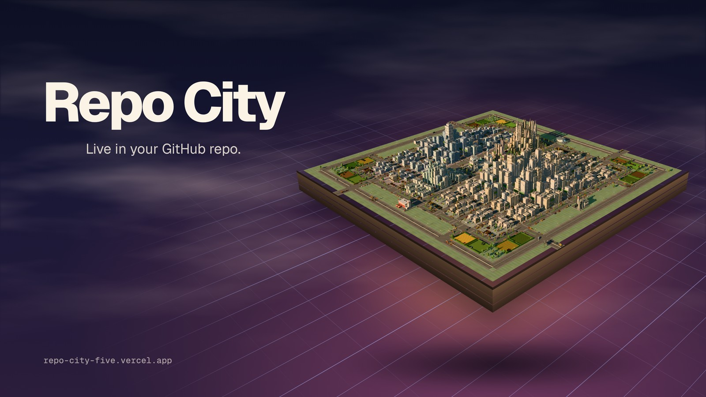
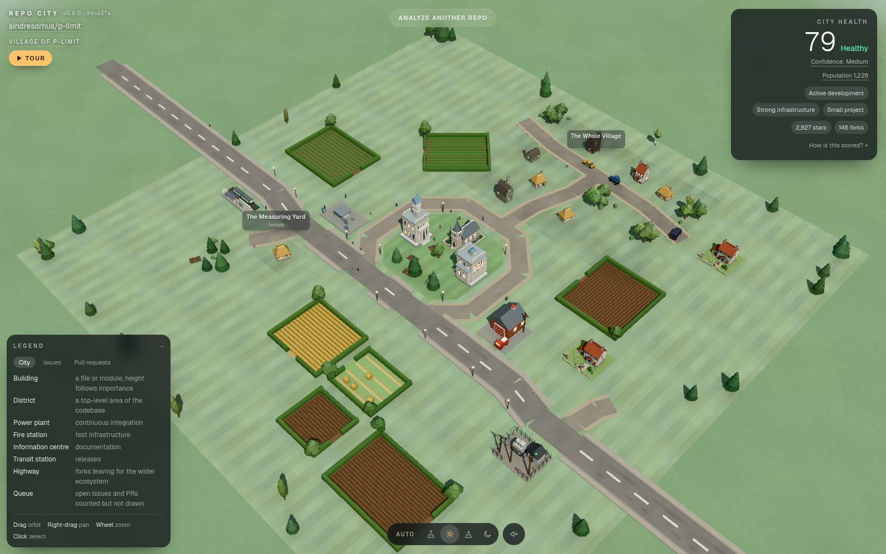
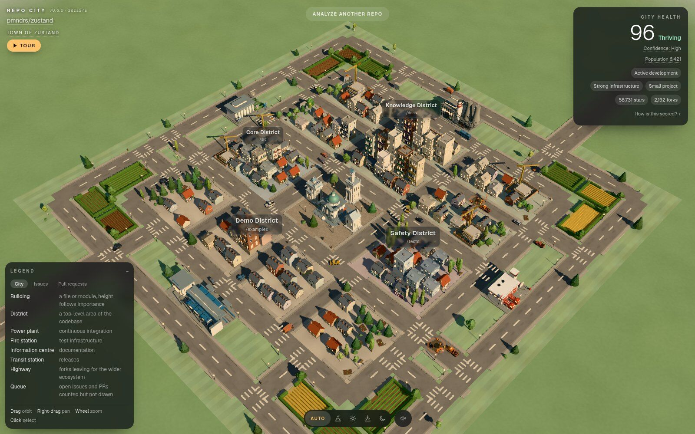
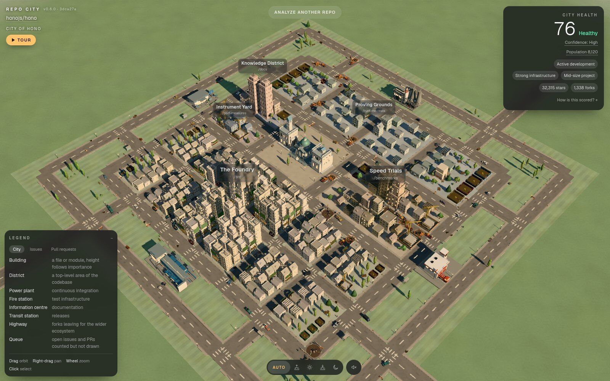
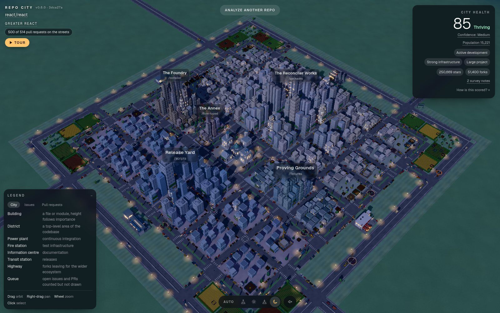
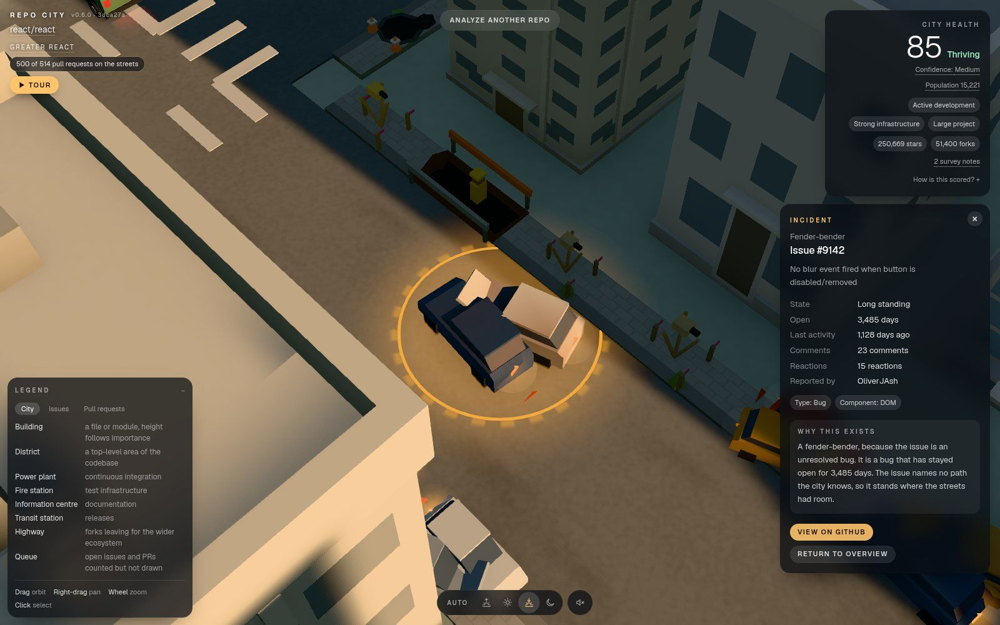
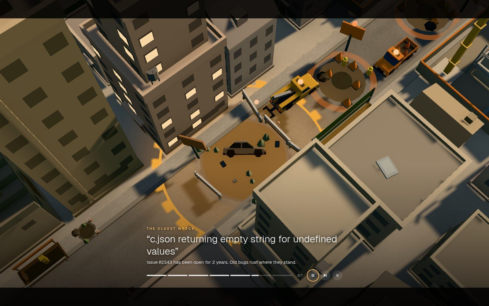

# Repo City

**Live demo: <https://repo-city-five.vercel.app>**



Type the name of any public GitHub repository and it becomes a 3D city you can fly around.
Files are buildings and top-level folders are districts. Every open issue is something wrong
in the street: a fire, a crash, a pothole, a roadblock. Every open pull request is building
work: scaffolding, a trench, a works van. A small library becomes a village and a giant
becomes a metropolis. Click anything and the city shows you the real GitHub record behind it.

All of it happens on one screen. There is one route, one 3D viewport and no page changes.
Surveying a second repository rebuilds the world in place.

## Try it

Open <https://repo-city-five.vercel.app> and type one of these into the box:

| Type this | What you get |
| --- | --- |
| `sindresorhus/p-limit` | A village: lanes, cottages, fields and a chapel on the green |
| `pmndrs/zustand` | A town with a high street of shops |
| `honojs/hono` | A city with hundreds of open issues and PRs, every one drawn |
| `facebook/react` | A metropolis: glass towers, avenues, a motorway ring and a queue of PRs at the city limits |
| `atom/atom` | An archived repository: cold light, empty roads, cranes that stopped |

Two address options work on any visit:

- **`?tour=1`** plays a one-minute guided fly-through as soon as the city is built:
  <https://repo-city-five.vercel.app/?tour=1>. The Tour button under the city's name does the
  same thing at any time.
- **`?time=night`** (or `morning`, `afternoon`, `evening`) sets the time of day:
  <https://repo-city-five.vercel.app/?time=night>. Both options combine:
  `?tour=1&time=night`.

| Village | Town | City |
| --- | --- | --- |
|  |  |  |

| Metropolis at night | A crowd object up close | The tour |
| --- | --- | --- |
|  |  |  |

## What you see and what it means

### The settlement

Size comes from the codebase: files plus twice the folders, counted before any cap. Recent
activity can lift a settlement one step if it is already near the top of its band. Activity
never lowers a tier, and an archived repository is never promoted.

| Tier | Typical repository | What it looks like |
| --- | --- | --- |
| Village | under about 120 files and folders | Winding lanes, cottages and farmhouses, fields with hedgerows, a chapel on the village green |
| Town | up to about 600 | A grid of streets, a high street of shops, small civic buildings, low apartment blocks |
| City | up to about 10,000 | Dense blocks of towers, a ring road, highways out |
| Metropolis | 10,000 and up, or a tree GitHub truncates | Glass towers, twin towers and spires, avenues with planted medians, a motorway ring |

The HUD names it: "Village of p-limit", "Town of zustand", "City of hono", "Greater react".
Hovering the name gives the reason.

### The city

| Repository | In the city |
| --- | --- |
| A file or module | A building. Height follows how central the file is; wear follows how long since it changed |
| A top-level folder | A district, with its own plot, colour and sign |
| Continuous integration | The power plant. Passing CI hums; failures show. No GitHub Actions means no power plant, not a broken one |
| Tests | The fire station |
| Documentation | The information centre |
| Releases | The transit station, with trains arriving on the release cadence |
| Forks | Highways leaving for the wider ecosystem |
| Commits and contributors | Traffic, pedestrians and lit windows |
| Archived | Cold light, empty roads, idle cranes and an "Archived repository" label. Reported as a fact, never as a failure |
| Health | One 0-100 score in the corner, with the weights behind it and how confident it is |

### Every open issue

Up to 1,000 open issues are drawn, one object each, most recently active first. The most
pressing dozen or so are full incident scenes with crews and emergency vehicles. The rest take
one of seven forms, chosen from the issue's labels, title and state:

| Form | Means |
| --- | --- |
| Fire | Security work, or a severe bug drawing heavy discussion |
| Fender-bender | A bug |
| Abandoned wreck | Untouched for a long time, with nothing in its labels to say otherwise |
| Roadblock | Blocked, on hold, or waiting on an answer |
| Signpost | Documentation, typos, the website or examples |
| Survey pegs | A feature request, proposal or idea |
| Pothole | Routine upkeep, including good first issues |

More discussion makes an object bigger and brighter. Age shows as rust.

### Every open pull request

Up to 500 open PRs are drawn. The leading ones are full construction sites with cranes. The
rest:

| Form | Means |
| --- | --- |
| Scaffolding | Code changes, on the building they touch |
| Trench | CI, build, tooling or chores: the road is dug up |
| Utility works van | A bot or a dependency bump |
| Hoarding | A fenced empty plot: still a draft |

Signals on top: a **red beacon** when checks fail, a **stop board** when a reviewer asked for
changes, a **green flag** when approved. Rust means nobody is working on it; grey means the
work is slow.

When a repository has more open issues or PRs than the ceilings, or than the streets have
room for, the rest wait in a **queue at the city limits**: gridlocked cars on the roads in and
a signboard with the real count. A chip in the HUD says "500 of 514 pull requests on the
streets".

Every object can be hovered and clicked. The inspector shows the real GitHub record, a link to
it, and a **"Why this exists"** line that states the rule that put it there.

## Controls

| Action | Mouse | Touch |
| --- | --- | --- |
| Orbit | Drag | One finger |
| Pan | Right-drag | Two fingers |
| Zoom | Wheel | Pinch |
| Inspect | Click an object | Tap |
| Back to the overview | Escape, or "Return to overview" | "Return to overview" |

- **Time of day:** the pill at the bottom. Auto picks the hour from the repository (busier
  means later in the afternoon; archived stays at a cool midday), or choose morning,
  afternoon, evening or night. Night brings stars, a moon, lit windows and lamp pools.
- **Sound:** the speaker beside it. Off by default. Wind, birds and crickets, traffic, trains,
  sirens and building sites, all synthesized in the browser from the city on screen; nothing is downloaded.
- **Tour:** Space pauses, the right arrow skips to the next stop, Escape ends it. Dragging
  the city also ends it.
- **Analyze another repo** at the top opens the box again over the same city.

## How it works

```
GitHub -> Repository snapshot -> Deterministic metrics -> Architecture interpretation
       -> City model -> 3D renderer
```

Three layers, kept apart:

```
DATA            GitHub facts          lib/github/*        types/repository.ts   server only
INTERPRETATION  metrics + AI          lib/analysis/*      types/analysis.ts     crosses the wire
                                      lib/ai/*
WORLD           the 3D city           lib/city/*          types/city.ts         browser only
                                      components/city/*
```

**The survey.** `app/api/analyze/route.ts` fetches the repository over REST and GraphQL in
parallel: metadata, the file tree, open issues and PRs page by page, CI runs, commits,
contributors and releases. It streams newline-delimited JSON back, one `stage` line per real
step, then one `result` or `error` line. The progress panel shows only the events it receives.
The HTTP status is always 200, because a streamed body cannot change its status after the
first byte; failures travel in-band.

**Health is deterministic.** Maintenance 30%, reliability infrastructure 25%, documentation
20%, organization 15% and responsiveness 10%, computed from GitHub data with no model
involved. It reads a fixed sample (the 100 most-discussed open issues and the 50 most
recently updated PRs), so drawing every issue did not move anyone's score. It reports its own
confidence and says plainly that it is a visualization, not an audit.

**The city is deterministic.** The seed is `owner/name@headSha`. Every random choice comes
from a seeded generator with its own salt per subsystem; nothing calls `Math.random()` or
`Date.now()`. The same revision always builds the same city.

**The AI is optional.** An architecture interpretation can name districts and describe what
modules do. The adapter supports Anthropic, OpenAI, Google and any OpenAI-compatible endpoint,
and it is off on the hosted demo (`AI_PROVIDER=none`). Twelve reference repositories have
curated interpretations committed under `fixtures/interpretations/`, and every path in them is
checked against the live tree on each request, so a stale file degrades instead of lying. Any
other repository gets its district names from its folder names.

**Caching and limits.** A completed survey is cached in process for 15 minutes under the
canonical name, and GitHub responses are revalidated every 10 minutes. Each visitor gets 10
surveys per 10 minutes, checked after the cache, so opening a repository someone already
surveyed is free. When GitHub rate-limits a repository that has a snapshot in `fixtures/`,
the route serves the snapshot and the HUD says so.

## Performance and quality

The renderer measures itself and never guesses from the GPU name.

| Tier | Gives up |
| --- | --- |
| High | Nothing: ambient occlusion, bloom, antialiasing, a 2,048 shadow map, up to 2x resolution |
| Medium | Ambient occlusion; resolution capped at 1.5x. Phones start here |
| Low | The post-processing composer, half the shadow map and textures, smoke and halos; resolution capped at 1.25x |

It probes once on the empty stage and once after the first city is built, and keeps a frame
guard running: if frames stay slow for eight seconds, it steps down once more. It only steps
down, so it cannot flap. No tier ever hides a building, an issue or a pull request.

Instancing keeps the crowd cheap: about 22 draw calls cover every crowd object, whether there
are 50 or 1,500, and picking uses a custom per-instance raycast. A new city is built in the
background (`useDeferredValue` inside the canvas) while the old one keeps drawing, so arrival
does not freeze the page. If WebGL is missing or the context is lost, the page says so in
plain words.

`?quality=low|medium|high` pins a tier for testing.

## Local development

```bash
pnpm install
cp .env.example .env.local   # add your own GITHUB_TOKEN; never commit this file
pnpm dev
```

Then open <http://localhost:3000>.

| Script | What it does |
| --- | --- |
| `pnpm dev` | Development server |
| `pnpm build` / `pnpm start` | Production build and server |
| `pnpm test` | Unit tests (vitest) |
| `pnpm typecheck` | `next typegen`, then `tsc --noEmit` |
| `pnpm lint` | ESLint |
| `pnpm city:stats` | Builds a city from an analysis JSON without the renderer and prints counts, bounds and an ASCII map |
| `pnpm fixture`, `pnpm fixture:backlog`, `pnpm fixture:stress` | Regenerate the development fixtures |

In development only, typing `fixture`, `backlog` or `stress` into the box loads a committed
analysis without calling GitHub, and `?tier=village|town|city|metropolis` forces a tier.
`scripts/perf-baseline.ts` runs the headless performance checks.

| Variable | Required | Purpose |
| --- | --- | --- |
| `GITHUB_TOKEN` | yes | Fine-grained token with public-repository read access and nothing else |
| `AI_PROVIDER` | no | `none` (default), `anthropic`, `openai`, `google` or `openai-compatible` |
| `AI_MODEL`, `AI_API_KEY`, `AI_BASE_URL` | no | Model, key and endpoint for the chosen provider |
| `AI_MAX_PER_HOUR` | no | Cap on runtime AI calls per instance per hour. Default 60 |
| `FIXTURE_FALLBACK` | no | Truthy to serve a committed snapshot when GitHub rate-limits. **Unset means off** |

Every credential stays on the server. Nothing uses `NEXT_PUBLIC_`.

## Limitations

- **Public repositories only.** GitHub returns the same 404 for a missing repository and a
  private one, so both get the same message.
- **Large trees are surveyed partially.** The file tree is capped at 5,000 entries and six
  levels deep, and a metropolis draws at most 450 buildings. The settlement tier still uses
  the uncapped counts, and the HUD says when a survey was partial.
- **Issue and PR ceilings.** 1,000 open issues and 500 open PRs are drawn at most; the rest
  are counted in the queue at the city limits.
- **Tests and documentation are detected from paths and config**, so a project that tests or
  documents itself in an unusual way will be under-read.
- **CI means GitHub Actions.** Another CI provider reads as no CI.
- **The cache and the rate limiter are per instance** and best effort.

## AI usage

Yard #3 is open-model. Repo City was built by Claude agents working in parallel git worktrees
against a written specification ([PLAN.md](./docs/PLAN.md)), with Robert directing and reviewing.
Every commit names the model that wrote it in a `Co-Authored-By` trailer. The full
declaration is in [AI_MODELS.md](./AI_MODELS.md). No model runs at request time on the hosted
demo.

A script recorded the demo video from the live site, frame by frame on a real GPU. The
narration is local text to speech, and the edit is automated. The whole pipeline is in
[scripts/video](./scripts/video).

## Hackyard Yard #3

Theme: **One Screen**. Solo build by [Robert](https://github.com/Robertg761). Build window:
21 September 2026 18:00 UTC to 25 September 2026 18:00 UTC, and all project code was written
inside it. The project's own rule, from PLAN.md section 0.2: you can go anywhere, but you never
leave the city screen. Submission material and the demo script are in [docs/](./docs).

## License

[MIT](./LICENSE)
